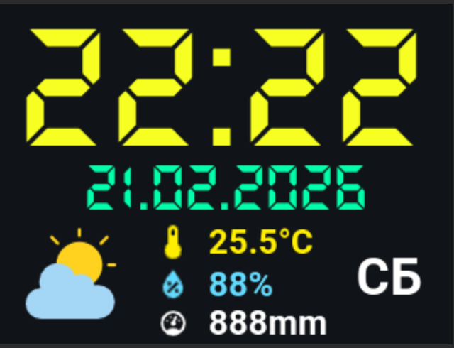

# 🕒 Smart Clock ESP32

<p align="center">
  
</p>

[](https://platformio.org/)
[](https://www.arduino.cc/)
[](https://www.espressif.com/en/products/socs/esp32)

Профессиональное решение для умных часов на базе **ESP32**, **LVGL 8.3** и дисплея **ST7789**. Проект объединяет современный графический интерфейс, синхронизацию времени по NTP, прогноз погоды и удобную настройку через веб-интерфейс.

---

## ✨ Основные возможности

- 🖥️ **Графический интерфейс**: Построен на библиотеке **LVGL 8.3** (дизайн SquareLine Studio).
- ☁️ **Погода**: Получение данных (температура, влажность, давление, иконки) через **OpenWeatherMap API**.
- ⏰ **Точное время**: Синхронизация по **NTP** с автоматическим учетом временных зон.
- 🌓 **Ночной режим**: Автоматическое управление яркостью подсветки (ШИМ) по расписанию.
- 🌐 **Web-интерфейс**: Настройка WiFi, города и параметров яркости без перепрошивки.
- 🛜 **Captive Portal**: Режим точки доступа (AP) для начальной настройки при отсутствии сети.
- 📲 **OTA**: Беспроводное обновление прошивки по Wi-Fi.

---

## 🛠️ Требования

- **IDE**: [VSCode](https://code.visualstudio.com/) с расширением [PlatformIO](https://platformio.org/install/ide?install=vscode).
- **Core**: Python 3.11+.
- **Hardware**: ESP32 (DevKit v1), Дисплей ST7789 (240x320), Тачскрин XPT2046.

---

## 🚀 Быстрый старт

### 1. Подготовка конфигурации
Переименуйте `include/secrets.h.example` в `include/secrets.h` и заполните ваши данные:
```cpp
const char* weatherApiKey = "ВАШ_КЛЮЧ_ОТ_OPENWEATHER";
const char* city = "Kyiv";
```

### 2. Сборка и прошивка
Используйте иконки в нижней панели VSCode:
- ✔️ **Build** (Сборка)
- ➡️ **Upload** (Загрузка)
- 🔌 **Serial Monitor** (Логи)

Или через CLI:
```bash
pio run -t upload && pio device monitor
```

---

## 🔌 Подключение оборудования

### 1. Дисплей (ST7789)
| Пин дисплея | Пин ESP32 | Описание |
| :--- | :--- | :--- |
| **VCC** | 3.3V | Питание |
| **GND** | GND | Земля |
| **SCL (SCLK)** | 18 | SPI Clock |
| **SDA (MOSI)** | 23 | SPI Data |
| **RES (RST)** | 33 | Reset |
| **DC** | 27 | Data / Command |
| **CS** | 5 | Chip Select |
| **BLK (BL)** | 22 | Подсветка (PWM) |

### 2. Тачскрин (XPT2046)
| Пин тача | Пин ESP32 | Описание |
| :--- | :--- | :--- |
| **TSCK** | 12 | SPI Clock |
| **TMISO** | 13 | SPI MISO |
| **TMOSI** | 15 | SPI MOSI |
| **TCS** | 14 | Chip Select |
| **EN** | 3.3V | Питание Touch |

> [!NOTE]
> Все настройки пинов и частот SPI находятся в файле `platformio.ini` в блоке `build_flags`.

---

## ⚙️ Конфигурация

### Файл `secrets.h`
| Переменная | Описание |
| :--- | :--- |
| `weatherApiKey` | Ключ API OpenWeatherMap. |
| `city` | Город по умолчанию. |
| `TZ_INFO` | POSIX-строка временной зоны (Киев: `EET-2EEST,M3.5.0/3,M10.5.0/4`). |
| `ntpServer` | Сервер времени (например, `time.google.com`). |
| `OTA_HOSTNAME` | Сетевое имя устройства (`Clock-ESP32.local`). |

### Файл `cities_db.h` (База городов)
Хранит список для автодополнения в формате: `"RU|UA|EN|Code"`.
Пример: `"Львов|Львів|Lviv|UA"`. Использует `PROGMEM` для экономии SRAM.

---

## 📡 Веб-интерфейс и OTA

1. **Режим настройки**: Если часы не могут найти WiFi, они создают точку доступа `Clock-Setup-XXXX`. Подключитесь к ней, и откроется страница настройки.
2. **Обновление по воздуху (OTA)**:
   Чтобы прошить удаленно, раскомментируйте строки в `platformio.ini`:
   ```ini
   upload_protocol = espota
   upload_port = Clock-ESP32.local
   ```

---

## 📂 Структура проекта

- `src/main.cpp` — ядро системы, логика WiFi, OTA и инициализация LVGL.
- `include/` — заголовочные файлы и конфигурация.
- `lib/ui/` — компоненты интерфейса (экспорт из SquareLine Studio).
- `platformio.ini` — глобальные настройки проекта и драйвера дисплея.

---

> [!IMPORTANT]
> Проект поддерживает **Arduino Core 3.0**. Библиотека `TFT_eSPI` и `LVGL` уже настроены для работы "из коробки" через флаги компиляции.
